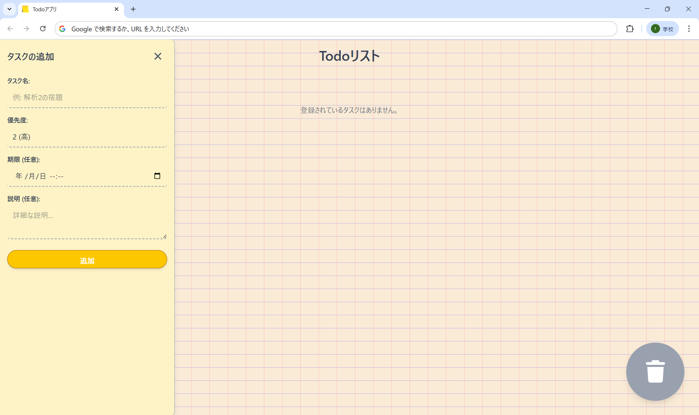
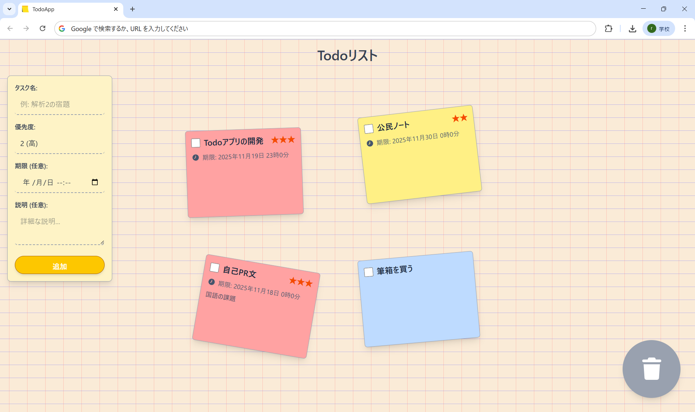
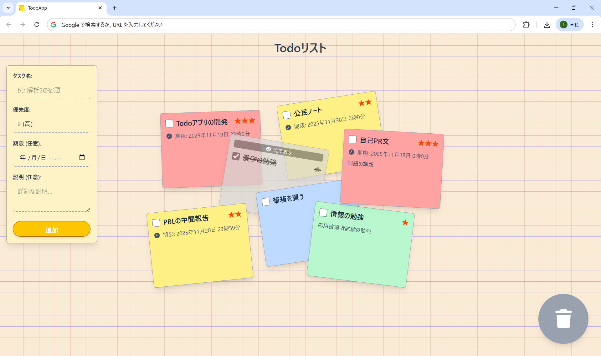

# TodoApp

本製作物はReact、TypeScript、Tailwind CSSを使用して開発した**付箋**をモチーフにしたTodoアプリです。機能面は一般的なTodoアプリと同じでタスク名、優先度、期限、詳細の四項目をタスクとして管理可能になっています。今回特に私が挑戦した部分はデザイン・UI面です。ノートに付箋を貼っていく雰囲気のデザインにしました。タスクを追加すると画面上に付箋が追加されドラックアンドドロップで好きな場所に移動可能です。下に表示されている画像は実際に本製作物を使用した様子です。タスクを自由自在に配置できる点が、本アプリの一番の特徴です。

## デプロイ先URL

https://sakuramochi444.github.io/react-todo2-app/

## 主な機能
- タスクの追加
- ドラッグ＆ドロップ
- タスクの削除
- 期限切れハイライト
- ローカルストレージでのデータ永続化

## 開発期間

- 2025.10.30 ~ 2025.11.18 (約20時間)